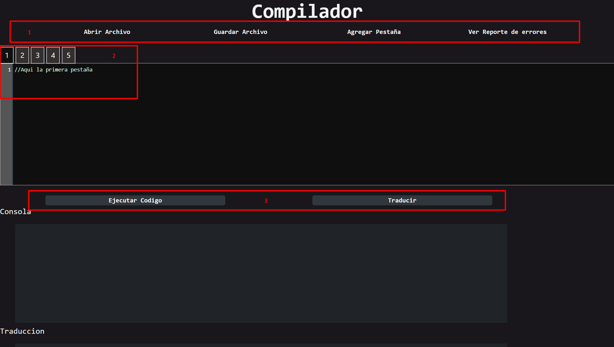
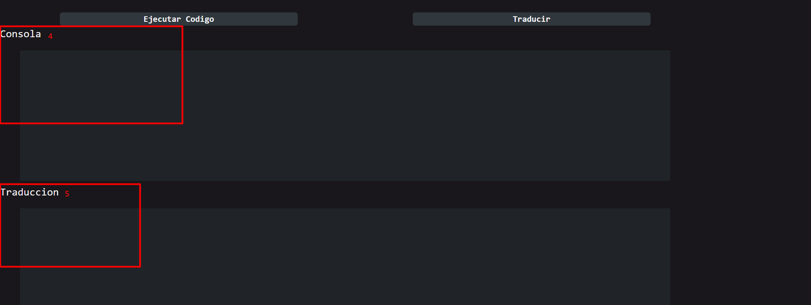
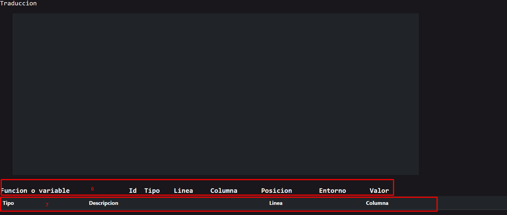

# Manual De usuario
### **Descripcion**
Compilador es un pequeño simulador de una IDE con un lenguaje singular, llamado Quetzal, es un lenguaje de programación inspirado en C, su característica principal es la inclusión de tipos implícitos. El sistema de tipos de Quetzal realiza una formalización de los tipos de C y Java. Esto permite a los desarrolladores definir variables y funciones tipadas sin perder la esencia. Otra inclusión importante de Quetzal es la simplificación de los lenguajes C y Java para poder realizar diferentes instrucciones en menos pasos.

Sus funciones principales del IDE es, ademas de realizar la respectiva compilacion de Quetzal, tambien realiza su traduccion con un formato de **3 direcciones** y que puede ser ejecutado en cualquier compilador del **lenguaje C**. 

### **Presentacion de la Interfaz**
En esta sección se mostrara como es el IDE y estar familiarizado cuando mas adelante se empiece a explicar su funcionamiento y su sintaxis.



#### Barra de Navegacion
La barra de navegacion es el contenido que esta dentro del **cuadro rojo** con el numero **1**.

Las primeras 2 instrucciones son las basicas.

- Abrir
    
El boton _Abrir Archivo_ realiza tal y como dice su nombre, se abrira una ventana para que encuentres un archivo (puede ser cualquier tipo de archivo) y se cargara a la pestaña actual.

- Guardar

El boton de _Guardar archivo_, al momento de ejecutarlo se abrira un prompt normal que preguntara el nombre con el que se guardara, es **opcional** darle un nombre, puesto que si acepta en blanco por defecto se guardara como _descargar_.

- Agregar Pestaña

Al presionar el boton de _Agregar Pestaña_ se creara otra pestaña. 

***Adertencia***: Actualmente sufre un error en donde al momento de crear un nueva pestaña, las otras se bloquearan, quedaran desactivadas y solo se podrá usar la creada.

- Ver reporte de Error

Al presionar _Ver reporte de Error_ automaticamente cambiara a _Ocultar reporte de error_ por si desea quitarlo. Este reporte de error se mostrara al final de la pagina, contiene el tipo de error, la linea, columna y la descripcion del error.

Es la que se presentara en el __cuadro rojo__ numero __7__.

#### Multipestaña
Es el contenido que esta dentro del **cuadro rojo** con el numero **2**.

Por defecto tiene 5 pestañas que se pueden utilizar de manera independiente.

#### Ejecucion
Esta ubicado dentro del **cuadro rojo** con el numero **3**.

Este es el lugar donde estan localizados los botones que ejecutaran sus repectivos nombres.

- Ejeutar Codigo

Realizara la simulacion de compilacion del lenguaje Quetzal y ejecutara lo escrito en la pestaña activa o la que esta siendo vista.

- Traducir

Realizara la traduccion del lenguaje Quetzal a un formato que cualquier __compilador de C__  lo comprenda y ejecute, con la unica diferencia que su salida sera de __3 direcciones__.



#### Consola
Esta ubicado dentro del **cuadro rojo** con el numero **4**.

En esta parte se encontrara un espacio de salida del lenguaje Quetzal. Normalmente se utlizara la instruccion ``print`` o ``println`` (Se mostrara como es su uso en el apartado de reglas del lenguaje).

#### Salida de Traduccion
Esta ubicado dentro del **cuadro rojo** con el numero **5**.

Esta es la seccion donde se mostrara el resultado traducicdo a un lenguaje C con formato de 3 direcciones.


#### Tabla de simbolos
Esta ubicado dentro del **cuadro rojo** con el numero **6**.

Cuando se utiliza la instruccion ``graficar_ts`` se tienen que imprimir todos los simbolos que Quetzal ha generado en el momento que se ejecuto, este es el lugar donde se mostra la funcion o variable con su respectiva informacion:

    -  Funcion o variable
    - Id
    - Tipo
    - Linea
    - columna
    - posicion
    - Entorno
    - valor

#### Reporte de Error
Esta ubicado dentro del **cuadro rojo** con el numero **7**.

En la seccion de Barra de navegacion, en la de __Ver reporte de Error__, cuando se presiona el boton aparecera esta seccion, que contiene:

    - Tipo de Error
    - Descripcion
    - Linea
    - columna

Si existe algun error del tipo semantico, lexico o sintactico apareceran aqui.

**Nota**: No es el unico lugar donde se mostraran los errores, puesto que en el apartado de la consola tambien apareceran los errores, esta seccion lo hace ver de una forma mas ordenada por si costara entender el error en la consola.

### **Reglas de lenguaje**
En esta seccion se dará a conocer los detalles del __lenguaje Quetzal__ y sus instrucciones para que puedan probar el IDE.

#### Estructura
La estructura del lenguaje, al igual que en Java, no importa donde este el metodo main, si antes o despues de las funciones realizadas, estructuras (que serian como las clases) y declararaciones globales.

```java
    //Declaraciones
    int declaraciones, declaraciones1,declaraciones2;

    //creacion de funciones
    void funciones(/*PARAMETROS_DECLARAR*/){

    }

    struct estructura {
        //lista de atributos. SOLO DECLARACIONES
        int atributo1,
        String atributo2
    }

    //Metodo main()
    void main(){
        //instrucciones
    }

```
El ejemplo mostrado es lo que puede realizar, casi todo lo que se mostro alli es opcional de colocar y la forma de colocarlo tambien.
Lo unico __obligatorio__ para que pueda ser ejecutado es el ___Metodo main()__

```java
    /*OBLIGATORIO PARA FUNCIONAR*/
    //Metodo main()
    void main(){
        //instrucciones
    }

```
Lo unico que no puede faltar es el metodo ***main()***, puesto que aqui es donde se corre las funciones, no lanzara un error si no se coloca, pero no ejecutara nada de lo que se realizo. 

El nombre se tien que escribir tal y como se muestra, puesto que, como en Java, el lenguaje es ***Sensible Case***, y no lleva **ningun parametro** entre sus parentesis.

#### **Instrucciones**

- Comentarios

Como todo buen lenguaje, se necesita los comentarios para dar referencias al mismo programador, lineas de codigo que pueden o no servir cuando se desarrolla, o hacer que otro tercero quiera leer y entender lo que se esta realizando.

Hay 2 tipos de forma de hacerlo: 
```java
    //PRIMERA OPCION
    //COMENTARIOS DE UNA SOLA LINEA

    /*
        SEGUNDA OPCION
    */

    /*
        COMENTARIOS
        DE
        MULTIPLES LINEAS
    */
```

- declaraciones y asignaciones

```java
    //TIPO_VARIABLE ID ;
    int varNum;
    String cadena;
    double puntoFlotante;
    boolean booleano;
    char caracter;

    //ASIGNACIONES
    varNum = 100;
    String cadena2 = "asignando valor a cadena2";

    //DECLARACION Y ASIGNACION AL MISMO TIEMPO
    int[] arreglo = [1,2,3,4,5,6,7,8];
```

- imprimir en consola

    Esta instruccion se divide en 2, una es ``print`` y la otra es ``println`` donde la unica diferencia es que, el que termina con ``ln`` tiene un salto de linea despues de su impresion.
    
```java
    //print
    print("hola ");
    print("mundo");
    /*Resultado:
        hola mundo
    */

    //println
    println("hola");
    println("mundo");
    /*Resultado:
        hola
        mundo

    */
```

El print puede imprimir valores de cualquier variable que tenga, para esto existen 3 formas de realizarlo:

```java
    //CONCATENACION &
    String cadena = "CADENA VALOR";
    println("concatenando la variable cadena que tiene le valor"& cadena &", usando & ");

    //CONCATENACION COMAS ,
    println("concatenando la variable cadena que tiene le valor", cadena ,", usando Comas (,) ");

    //CONCATENACION CON $
    println("concatenando la variable cadena que tiene le valor $cadena , usando el signo de dolar");

```

- Operaciones aritmeticas nativas

```java
    //Se expresa de la siguiente manera:
    sin(134) //seno 
    cos(var1) // coseno
    tan(12) //tangente
    sqrt(16) // raiz cuadrada
    pow(2,3) //potencia

```
Las funciones trigonometricas tienen su entrada en grados hexadecimales.


- Operaciones nativas de cadenas

```java
    //CONCATENCIACION
    "para" & "caidismo"; // = "paracaidismo"

    //REPETIR CADENA
    "Cadena"^3;          //= "CadenaCadenaCadena"

    //ACCEDER A UN CARACTER
    animal = "Tigre";
    println(animal.caracterOfPosition(2)); //g

    //EXTRAER UNA PORCION
    animal = "Tigre";
    println(animal.subString(2,4)); //gre

    //TAMAÑO DE UNA CADENA
    animal = "Tigre";
    println(animal.length()); //5

    //MAYUSCULA
    animal = "Tigre";
    println(animal.toUppercase()); //TIGRE

    //MINUSCULA
    animal = "Tigre";
    println(animal.toLowercase()); //tigre

```

Cabe resaltar que la operacion del **tamaño** tambien aplica para los arreglos.

- Ternario
  Es un **if** que se ejecuta en una sola linea y que retorna un valor.

```java
    // expresion booleana ? resultado verdadero : resultado falso 
    edad = 50;
    String respuesta = edad >= 50 ? "Puede vacunarse" : "No puede vacunarse";  // respuesta = Puede vacunarse
```

- Llamadas de funciones

Cuando realizamos una funcion necesitamos de llamarla ya sea porque necesitamos su valor o que se opere por lo que tiene.

```java
    //funcion recursiva que devuelve el factorial de un numero
    int fact(int n){
	    return n == 1 ?  n : n * fact(n-1);
    }
    //NOMBRE_FUNCION(LISTA_PARAMETROS);

    int fact = fact(6);//llamamos a la funcion
    //fact = 720;
    
```

- Ciclo For

```java
    /*
        for (declaracion ó asignacion; condicion; instruccion) {
            LISTA_INSTRUCCIONES
        }
    */

    //Ejemplo:
    for (int i = 0; i < 5; i++) {
        println(i);
    }

    /*
        OTROS TIPOS
    */

    for letra in "Hola Mundo!"  // Recorre las letras de la cadena
    {
        print(letra, "-");      // Imprime H-o-l-a-M-u-n-d-o-!
    }

    String cadena = "OLC2";
    for letra in cadena
    {
        print(letra, "-");      // Imprime O-L-C-2
    }

    int[] arr = [1,2,3,4,5]
    for numero in arr[2:4]{
        print(numero, " ")      // Imprime 2 3 4
    }

```

- Ciclo While

```java
    /*
        while (CONDITION) {
          LISTA_INTRUCCIONES
        }
    */
    int i = 0;
    while (i < 5) {
        println(i);
        i++;
    }
```

- Ciclo Do While

```java
    /*
        do {
            LISTA_INSTRUCCIONES
        }
        while (CONDICION);
    */

    int i = 0;
    do {
        println(i);
        i++;
    }
    while (i < 5);
```

- If

```java
    /*
        if(CONDICION1){
        LISTA_INTRUCCIONES
        }
        else if(CONDICION1){
        LISTA_INTRUCCIONES
        }
        else{
            LISTA_INTRUCCIONES
        }
    */

    if (false){
    	println("true");
	}else{
    	println("false");
    } 
```

- Switch

```java
    /*
        switch(expression) {
        case x:
            LISTA_INTRUCCIONES
            break;
        case y:
            LISTA_INTRUCCIONES
            break;
        default:
            LISTA_INTRUCCIONES
        }
    */

    int a = 2;
	switch(a) {
      case 1:
       	print("hola mundo");
        break;
      case 2:
       println("hola mundo 22");
        break;
      default:
      print("hola mundo 3");
      int a;
	}
```

- Struct

```java
    /*
        // Declaracion de struct
        struct NOMBRE_STRUCT
        {
            LISTA_ATRIBUTOS
        };
    */

    struct str{
        int a,
        boolean b
    };

    /*
        //CREACION DE UNA VARIABLE DEL TIPO STRUCT
        NOMBRE_STRUCT ID = NOMBRE_STRUCT(LISTA_VALORES);
    */

    void main(){
        str a =  str(2,true);
        println(a); // str(2 , true)
        a.a = 10 ;    
        println(a); // str(10 , true)
    }

```

***RECORDAR***: Las instrucciones tienen que terminar siempre con **punto y coma** (``;``), excepto los ciclos y condicionales, Igual que en Java.

En el repositorio existe una carpeta llamada **entradas** que tienen ejemplos funcionales para que puedan probarlo de una vez sin crearlo desde cero.

### **Generacion de Codigo 3 direcciones**

Cuando se ejecuta la traduccion, empieza a traducir todo el codigo que fue escrito anteriormente a un ***codigo 3 direcciones*** que puede ser ejecutado en cualquier **compilador de C** existente.

- Ejemplo:

Con el lenguaje Quetzal se realizara el siguiente codigo:
```java
    void main(){
        int num = 22;
        int operacion = num * 2 + 3;
        println(operacion); //imprime 47
    }
```
Ahora al traducir, la salida en el espacio de traduccion, que es la **caja roja** numero **5** aparecera como:

```c
    #include <stdio.h> 
    #include <math.h> 
    double heap[30101999]; 
    double stack[30101999]; 
    double P; 
    double H;
    double t0,t1,t2,t3;

    void main() { 
        P = 0; 
        H = 0;
        stack[(int)0] =22;
        t0=stack[(int)0];
        t1=t0*2;
        stack[(int)1] =t1+3;
        t2=stack[(int)1];
        printf("%f" , (double)t2);
        printf("%c", (char)10);

        return; 
    }
```
Que si lo ejecutamos en un compilador de C, su respuesta sera la misma que en la consola de la IDE del compilador.
No se adentrara a detalle como es el codigo 3 direcciones, puesto que ese no es el objetivo de este manual.
Sin embargo, se mostrara mas ejemplos del codigo 3 direcciones con su respectivo forma en el **lenguaje Quetzal**

- Ejemplo 2

```java
    void main() {
        int a = 2;
        switch(a) {
        case 1:
            print("hola mundo");
            break;
        case 2:
        println("hola mundo 22");
            break;
        default:
        print("hola mundo 3");
        int a;
        }
        
        if (false){
            println("true");
        }else{
            println("false");
        }
    }
```

Codigo 3 direcciones:

```c
    #include <stdio.h> 
    #include <math.h> 
    double heap[30101999]; 
    double stack[30101999]; 
    double P; 
    double H;
    double t0,t1,t2,t3,t4,t5,t6,t7,t8,t9,t10,t11,t12,t13,t14;
    void printString(){
        t12= P + 1;
        t13= stack[(int)t12];
        L9:
        t14= heap[(int)t13];
        if (t14==-1) goto L10;
        printf("%c", (char)t14);
        t13= t13+1;
        goto L9;
        L10:
        return; 
    }

    void main() { 
        P = 0; 
        H = 0;
        stack[(int)0] =2;
        t0=stack[(int)0];
        if(t0 == 1) goto L1;
        goto L2;
        L1:
        t2= H;
        heap[(int)H] = 104;
        H = H + 1;
        heap[(int)H] = 111;
        H = H + 1;
        heap[(int)H] = 108;
        H = H + 1;
        heap[(int)H] = 97;
        H = H + 1;
        heap[(int)H] = 32;
        H = H + 1;
        heap[(int)H] = 109;
        H = H + 1;
        heap[(int)H] = 117;
        H = H + 1;
        heap[(int)H] = 110;
        H = H + 1;
        heap[(int)H] = 100;
        H = H + 1;
        heap[(int)H] = 111;
        H = H + 1;
        heap[(int)H] = -1;
        H = H + 1;
        t3 = P + 2;
        t3 = t3 + 1;
        stack[(int)t3] = t2;
        P = P + 2;
        printString();
        P = P - 2;
        goto L5;
        L2:
        if(t0 == 2) goto L3;
        goto L4;
        L3:
        t4= H;
        heap[(int)H] = 104;
        H = H + 1;
        heap[(int)H] = 111;
        H = H + 1;
        heap[(int)H] = 108;
        H = H + 1;
        heap[(int)H] = 97;
        H = H + 1;
        heap[(int)H] = 32;
        H = H + 1;
        heap[(int)H] = 109;
        H = H + 1;
        heap[(int)H] = 117;
        H = H + 1;
        heap[(int)H] = 110;
        H = H + 1;
        heap[(int)H] = 100;
        H = H + 1;
        heap[(int)H] = 111;
        H = H + 1;
        heap[(int)H] = 32;
        H = H + 1;
        heap[(int)H] = 50;
        H = H + 1;
        heap[(int)H] = 50;
        H = H + 1;
        heap[(int)H] = -1;
        H = H + 1;
        t5 = P + 2;
        t5 = t5 + 1;
        stack[(int)t5] = t4;
        P = P + 2;
        printString();
        P = P - 2;
        printf("%c", (char)10);
        goto L5;
        L4:
        t6= H;
        heap[(int)H] = 104;
        H = H + 1;
        heap[(int)H] = 111;
        H = H + 1;
        heap[(int)H] = 108;
        H = H + 1;
        heap[(int)H] = 97;
        H = H + 1;
        heap[(int)H] = 32;
        H = H + 1;
        heap[(int)H] = 109;
        H = H + 1;
        heap[(int)H] = 117;
        H = H + 1;
        heap[(int)H] = 110;
        H = H + 1;
        heap[(int)H] = 100;
        H = H + 1;
        heap[(int)H] = 111;
        H = H + 1;
        heap[(int)H] = 32;
        H = H + 1;
        heap[(int)H] = 51;
        H = H + 1;
        heap[(int)H] = -1;
        H = H + 1;
        t7 = P + 2;
        t7 = t7 + 1;
        stack[(int)t7] = t6;
        P = P + 2;
        printString();
        P = P - 2;
        L5:
        if(0) goto L6;
        goto L7;
        L6:
        t8= H;
        heap[(int)H] = 116;
        H = H + 1;
        heap[(int)H] = 114;
        H = H + 1;
        heap[(int)H] = 117;
        H = H + 1;
        heap[(int)H] = 101;
        H = H + 1;
        heap[(int)H] = -1;
        H = H + 1;
        t9 = P + 2;
        t9 = t9 + 1;
        stack[(int)t9] = t8;
        P = P + 2;
        printString();
        P = P - 2;
        printf("%c", (char)10);
        goto L8;
        L7:
        t10= H;
        heap[(int)H] = 102;
        H = H + 1;
        heap[(int)H] = 97;
        H = H + 1;
        heap[(int)H] = 108;
        H = H + 1;
        heap[(int)H] = 115;
        H = H + 1;
        heap[(int)H] = 101;
        H = H + 1;
        heap[(int)H] = -1;
        H = H + 1;
        t11 = P + 2;
        t11 = t11 + 1;
        stack[(int)t11] = t10;
        P = P + 2;
        printString();
        P = P - 2;
        printf("%c", (char)10);
        goto L8;
        L8:

        return; 
    } 
```

- Ejemplo 3

```java
    void main () {
        int[] arr = [1,2,3,4,5];
        int operacion = arr[2];
        print(arr[2]);
    }
```
Codigo 3 direcciones en C

```c
    #include <stdio.h> 
    #include <math.h> 
    double heap[30101999]; 
    double stack[30101999]; 
    double P; 
    double H;
    double t0,t1,t2,t3,t4,t5;

    void main() { 
        P = 0; 
        H = 0;
        t1= H;
        heap[(int)H] = 1;
        H = H + 1;
        heap[(int)H] = 2;
        H = H + 1;
        heap[(int)H] = 3;
        H = H + 1;
        heap[(int)H] = 4;
        H = H + 1;
        heap[(int)H] = 5;
        H = H + 1;
        heap[(int)H] = -1;
        H = H + 1;
        stack[(int)0] =t1;
        t3 = stack[(int)0];
        t4 = t3 + 2;
        t5 = heap[(int) t4];
        printf("%f" , (double)t5);

        return; 
    }
```

### **Advertencias y consejos de seguridad**

- Manejo de structs
Se pueden tener un struct dentro de otro struct y acceder a los atributos de ese struct. No obtante, no se puede asignar valor nulo a un struct cuando se crea.

- Generacion de codigo 3 direcciones
Actualmente aun no esta completo todo el desarrollo del codigo 3 direcciones, con lo que los archivos que estan dentro de la carpeta *entradas* no funcionan todos para generar su traduccion.

- Recuperacion de errores
En la recuperacion de errores, no dejan analizar las instrucciones si no esta todo correcto de forma lexica como sintactico, luego empezara a interpretar cada accion realizada y si hay errores semanticos lo empezara a lanzar al finalizar toda la ejecución

- Procesamiento
El procesado que se realizo es algo pesado con lo que si hay muchas llamadas a funciones (como seria una llamada recursiva) puede llenar el stack, un ejemplo para mostrar el limite, es dentro de la carpeta entradas, hay un archivo que se llama funciones, y en el metodo recursiva1(int m, int n), en el main tiene los parametros m = 3 y n = 7, donde ese se puede decir que el stack casi a su limite, puesto que si cambia el valor de n = 8 , en la consola del navegador aparecera un desbordamiento de memoria, con lo que es aconsejable que, mientras se optimiza, sean funciones no tan cargadas.