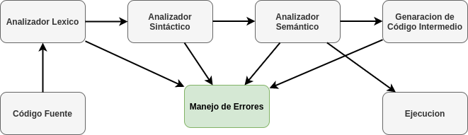
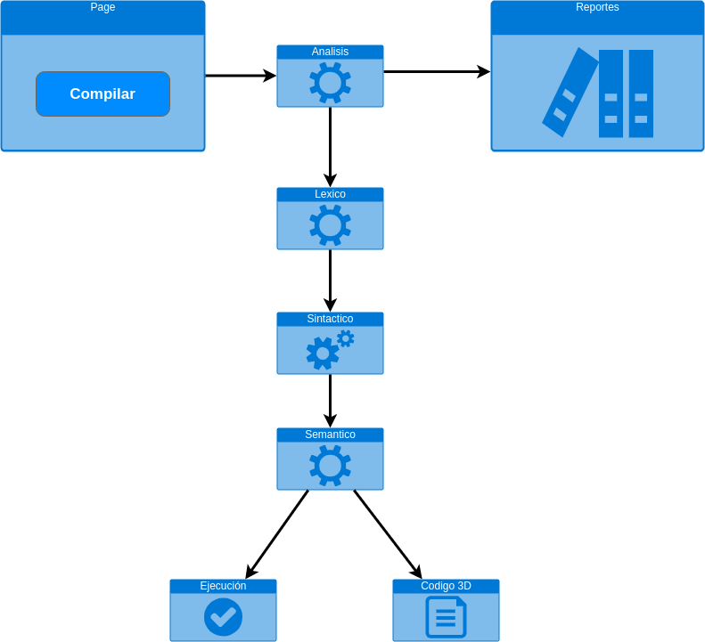

# Proy1Compi2Vac
## Integrantes
- William Rodrigo Umaña de León / 201931448
- Sergio Rolando Herdandez Perez / 201931555

# Manual Técnico

Manual técnico del Proyecto #1 de Organización de Lenguajes y Compiladores 2

## Librerías utilizadas
**CodeMirror**

CodeMirror se utiliza para poder mejorar el aspecto del editor de texto principal ademas de proporcionar información extra al usuario y asi mejorar la manera en que se utiliza el mismo editor.

**Bootstrap**

Utilizado para mejorar el aspecto de los botones, y áreas de texto que se utilizan en la pagina.

**JISON**

Este fue utilizado para la creación del analizador léxico y sintáctico, aunque no sea una librería que este activa al momento de utilizar la aplicación si se utilizo para su desarrollo.

**Browserify**

Esta es una herramienta que se utilizo para poder crear un bundle que contiene todos los archivos de JS que se generaron, ya sea mediante typescript o siendo generado por Jison. El bundle generado esta en lenguaje JS.


## Especificaciones 
El propósito de este proyecto es poner en practica las habilidades aprendidas en clase y laboratorio de Organización de lenguajes y compiladores 2, con el objetivo de realizar así una evaluación de estos conocimientos.

### Diseño
El diseño de esto proyecto se genera mediante el siguiente diagrama que representa las partes fundamentales de un compilador


Este compilador tiene que cumplir con lo descrito en el anterior diagrama. Análisis léxico, Análisis sintáctico y Análisis semántico, ademas de poder generar el código intermedio siendo el lenguaje final C.

Para generar estos analizadores primero se generan las expresiones regulares que realizaran el paso de texto común o código, a símbolos que luego serán utilizados por el analizador sintáctico. Ademas de estas expresiones también se contemplan las palabras reservadas y los signos que serán permitidos en el mismo analizador.

Todas estas especificaciones de los analizadores, están en el reporte gramatical. Ahí se encuentran las palabras reservadas, los símbolos, las expresiones regulares, ademas de la gramática utilizada y la manera en que estas se conectan.

**Diagrama de despliegue**


En este diagrama se representa la funcionalidad del proyecto.
El sistema esta compuesto por una pagina web encargada de realizar la compilación de traducción a código tres direcciones de un lenguaje en especifico mediante llamadas a funciones que están contenidas en un bundle de lenguaje de javascript.

## Compilación
Para poder compilar el proyecto o en dado caso se requiera realizar una actualizacion al mismo los comandos e instrucciones para poder compilar son los siguientes.

Para poder compilar las clases typescript en javascript se utiliza el comando:
```bash
tsc
```
Este comando se ejecuta en la raíz del proyecto de manera que pueda alcanzar todas las clases, el proyecto esta configurado para que estas clases se escriban dentro de la carpeta dist.

Para poder compilar la gramatica escrita en JISON, se utiliza el siguiente comando:
```bash
jison Gramatica.jison
```
Debe usted colocarse dentro de la carpeta llamada jison para que funcione.

Para poder generar el bundle que unirá todos los archivos javascript generados, se utiliza el siguiente comando
```bash
browserify ../ts/Ejecutar.ts -p [ tsify --noImplicitAny] > bundle.js
```
El comando debe ser ejecutado dentro de la carpeta disto. Aunque también existe un sh que realiza esto, el archivo se llama browserify_ts_alternativa. Este archivo se encuentra dentro de la carpeta dist.

# Reporte Gramatical

> En este reporte se describen las reglas gramaticales que se utilizaron para el diseño e implementación del proyecto.

## Analizador Lexico

- Palabras Reservadas: println, print, void, main, if, elseif, else,while, do,for,break, continue, switch, case, default, true, false, return, boolean, int, double, char, String, struct, begin, end, function, in, pow, sqrt, sin, cos, tan, parse, toInt, toDouble, string, typeof, push, pop, graficar_ts, caracterOfPosition, subString, length, toUppercase, toLowercase.
- Simbolos Reservados: <=, >=, ==, =, >, <, ||, &&, &, !, +=, -=, ++, --, +, *, /, %, '.', ',', ?, #, {, }, (, ), [, ],:,;
- Expresiones regulares: 

	D = [0-9]

	Ds = [1-9]

	EXPO = ([Ee][+-]?{Ds})

	STRING = "" o tambien,  \"([^"])*\"

	CHAR = '' o tambien, \'([^'])*\'

	ENTERO = DS

	FLOTANTE = ({Ds}"."{Ds}?{EXPO}?|{Ds}{EXPO}?)

	ID VARIABLE = [a-zA-Z][a-zA-Z0-9_]* o [A-Z][a-zA-Z0-9_]*

Estas expresiones, palabras y símbolos reservados son los utilizados por el analizador léxico en dado caso algún símbolo o palabra esta se agregara en la lista de errores que también pasara al analizador sintáctico.

## Analizador Sintáctico 

El analizador sintáctico utiliza la siguiente gramática para poder recoger y validar los símbolos y convertirlo en el árbol.
    
	inicio
        : EOF 
        | instrucciones EOF 

    instrucciones
        : instrucciones instruccion 
        | instruccion

    instruccion 
        : declaracion_bloque
        | asignacion_funcion
        | struct_declaracion


    struct_declaracion 
        : struct ID cuerpo_struct 
        | error cuerpo_struct             


    cuerpo_struct 
        : { } ;      
        | { contenido_struct } ;                 


    contenido_struct 
        : declaracion_struct                           
        | contenido_struct , declaracion_struct     


    declaracion_struct
        : tiposVar ID       
        | ID ID         


    asignacion_funcion
        : void main ( ) cuerpoFuncion                             
        | tiposVar ID ( parametros_funcion ) cuerpoFuncion    
        | void ID ( parametros_funcion ) cuerpoFuncion        


    parametros_funcion
        :   parametros_funcion , parametro_funcion   
        |   parametro_funcion                           
        |   epsilon    


    parametro_funcion
        : tiposVar ID 
        | tiposVar [ ] ID                       


    parametros_funcion_return
        : parametros_funcion_return , parametro_funcion_return   
        | parametro_funcion_return                                  
        |                                                           


    parametro_funcion_return
        : expresion


    cuerpoFuncion
        : { instrucciones_funciones }
        | { } 


    instrucciones_funciones
        : instrucciones_funciones instruccion_funcion
        | instruccion_funcion


    instruccion_funcion
        : declaracion_bloque    
        | asignacion_bloque     
        | print_bloque          
        | if_bloque             
        | for_bloque            
        | while_bloque          
        | switch_bloque         
        | funcion_return        
        | incremento_decremento 
        | funciones_arreglo     
        | returns_bloque        
        | rompimientos_bloque   
        | graficar_bloque              


    graficar_bloque
        : graficar_ts ( ) ;  


    rompimientos_bloque
        : break ;            
        | continue ;         


    returns_bloque
        : return ;               
        | return expresion ;     


    funciones_arreglo
        : ID . push ( expresion ) ;           
        | ID . pop ( ) ;                      


    incremento_decremento
        : ID ++ ;   
        | ID -- ;


    funcion_return
        : ID ( parametros_funcion_return ) ;      


    switch_bloque
        : switch ( expresion ) switch_cuerpo      
                
     
    switch_cuerpo
        : { }     
        | { casos_switch opcional_default }                 

    casos_switch
        : casos_switch caso_switch    
        | caso_switch                 

    caso_switch
        : case expresion : contenido_caso        


    contenido_caso
        : instrucciones_funciones


    opcional_default
        : default : contenido_caso            
        | epsilon                                    


    opcional_break
        : break ;            
        | continue ;         
        |                           

    declaracion_bloque
        : tiposVar nombreVars ;              
        | tiposVar nombreVars asignacion ;   
        | ID ID asignacion ;         
        | declaracion_arreglo                       


    declaracion_arreglo
        : tiposVar arr_decl nombreVars ;                 
        | tiposVar arr_decl nombreVars asignacion ;      


    asignacion_bloque
        : nombreAtributos asignacion ;                   
        | ID [ expresion ] asignacion ;    


    print_bloque
        : print ( expresiones_print ) ;        
        | println ( expresiones_print ) ;                    


    expresiones_print
        : expresion expresion_print               


    expresion_print
        : , expresion expresion_print                        
        |                                                       


    if_bloque
        : if ( expresion ) cuerpoFuncion sinos_bloque 


    instruccion_devuelta
        : instruccion_funcion 


    sinos_bloque
        : else cuerpoFuncion                                        
        | sino_si_bloque sinos_bloque                                   
        |                                                               

    sino_si_bloque
        : elseif ( expresion ) cuerpoFuncion     


    for_bloque
        : for ( decl_asign ; expresion ; expresion ) cuerpoFuncion      
        | for ID in ID cuerpoFuncion                                            
        | for ID in arr_decl cuerpoFuncion                                          
        | for ID in arr_begin_end cuerpoFuncion                                     


    while_bloque
        : while ( expresion ) cuerpoFuncion           
        | do cuerpoFuncion while ( expresion )    


    decl_asign
        : tiposVar nombreVars asignacion        
        | nombreAtributos asignacion            


    arr_decl
        : [ parametros_arreglo ] 
        | [ ] 


    parametros_arreglo
        : expresion_arreglo                          
        | parametros_arreglo , expresion_arreglo  


    expresion_arreglo
        : expresion         


    arr_begin_end
        : ID [ expresion : expresion ]  
        | ID [ begin : expresion ]  
        | ID [ begin : end ]    
        | ID [ expresion : end ]    


    tiposVar 
        : String    
        | double    
        | int   
        | boolean   
        | char      


    nombreVars 
        : ID 
        | nombreVars , ID 


    nombreAtributos    
        : ID nombreAtributos_prima   


    nombreAtributos_prima
        : . ID nombreAtributos_prima  
        |                                       


    asignacion
        : OP_IGUAL expresion    


    expresion
        : primitivas                
        | logicas                   
        | operadores                
        | relacionales              
        | expresion_ternario        
        | incr_decr                 
        | nativas                   
        | expresion_arr_arreglo     
        | expresion_atributos       
        | otras_nativas             
        | error                     


    expresion_arr_arreglo
        : arr_decl                                          
        | ID [ expresion ]                    
        | arr_begin_end                                     


    expresion_atributos
        : expresion . ID                           
        | expresion . LENGTH ( )                 
        | expresion . STR_POP ( )                
        | expresion . UPPERCASE ( )              
        | expresion . LOWERCASE ( )              
        | expresion . CHARPOS ( expresion )                             
        | expresion . SUBSTRING ( expresion , expresion )            


    expresion_ternario
        : expresion ? expresion : expresion         


    logicas
        : expresion && expresion    
        | expresion || expresion     


    relacionales
        : expresion == expresion  
        | expresion != expresion    
        | expresion >= expresion  
        | expresion <= expresion  
        | expresion < expresion    
        | expresion > expresion    


    operadores
        : expresion * expresion   
        | expresion / expresion   
        | expresion + expresion   
        | expresion - expresion  
        | expresion & expresion    
        | expresion ^ expresion    
        | expresion % expresion    
        | ( expresion )           
        | - expresion
        | ! expresion              
    

    incr_decr
        : primitivas ++         
        | primitivas --         
    

    nativas
        : pow ( expresion , expresion )  
        | sqrt ( expresion ) 
        | sin ( expresion )  
        | cos ( expresion )  
        | tan ( expresion )  
    

    otras_nativas
        : tiposVar . parse ( expresion )    
        | toInt ( expresion )                     
        | toDouble ( expresion )                  
        | string ( expresion )                    
        | typeOf ( expresion )                    
    

    primitivas
        : false             
        | true              
        | ENTERO                
        | FLOTANTE              
        | STRINGL              
        | CHARL                 
        | ID               
        | ID ( parametros_funcion_return )       
        | null              
    

